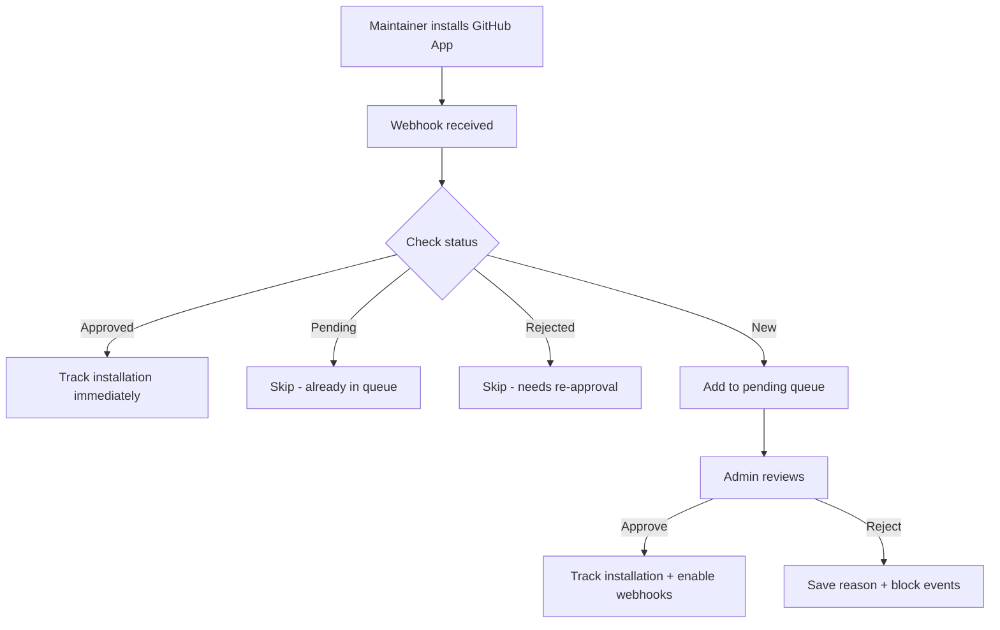
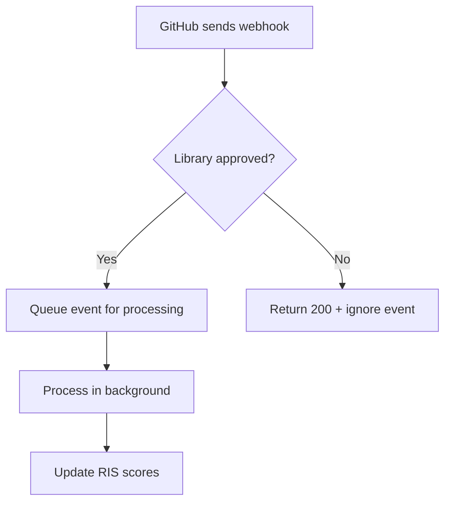

# RIS Library Approval System

## Overview

The RIS Library Approval System ensures that only React-related libraries are included in the React Impact Score calculations. When someone installs the GitHub App on their repository, it goes through an approval workflow before being added to the ecosystem.

---

## How It Works

### 1. App Installation

When a maintainer installs the GitHub App on their repository:

1. **Webhook received** at `/api/webhooks/github`
2. **Library details extracted** (owner, repo, description, stars, topics, language)
3. **Status checked**:
   - **Approved** → Installation tracked immediately
   - **Pending** → Do nothing (already in queue)
   - **Rejected** → Ignored (admin must re-approve)
   - **New** → Add to pending queue for admin review

4. **Webhook events filtered** - Only approved libraries receive real-time updates

---

## Admin Approval Workflow

### Pending Queue

Admins see pending libraries in the admin dashboard (`/admin/data`):

**Information Displayed:**
- Repository name and GitHub link
- Description
- Star count
- Programming language
- Topics/tags
- Installation date

**Actions:**
- ✅ **Approve** - Adds library to ecosystem and enables RIS collection
- ❌ **Reject** - Removes from pending with a reason (saved for history)

### Approval Process

1. **Admin reviews library**
   - Check if it's React-related
   - Review description and topics
   - Consider star count and activity

2. **Admin clicks "Approve"**
   - Library moves from pending to approved
   - Installation is tracked in Redis
   - Webhook events start being processed
   - Library gets RIS score on next collection

3. **Admin clicks "Reject"**
   - Library moves from pending to rejected
   - Rejection reason saved
   - Installation removed (if existed)
   - Future webhook events ignored

---

## Proration for Mid-Quarter Approvals

### Why Proration?

If a library is approved mid-quarter, it shouldn't receive the full quarter's allocation. Proration ensures fair distribution based on days active.

### How It Works

**Example:**

```
Quarter: Q1 2025 (Jan 1 - Mar 31, 90 days)
Library approved: Feb 14
Days remaining: 45 days
Proration factor: 45 / 90 = 50%
```

If the library would normally receive **$10,000**, it receives **$5,000** (prorated).

### Implementation

1. **Approval date stored** when admin approves library
2. **Quarter dates calculated** from period string (e.g., "2025-Q1")
3. **Proration factor** = days remaining / total days
4. **Allocation adjusted**: `allocation = base_allocation × proration_factor`

**Formula:**
```typescript
const totalDays = quarterEnd - quarterStart (in days)
const daysRemaining = quarterEnd - approvalDate (in days)
const prorationFactor = daysRemaining / totalDays
const proratedAllocation = baseAllocation × prorationFactor
```

---

## Redis Schema

### Pending Libraries
```
ris:libraries:pending (hash)
  └─ "owner/repo" → JSON({
      owner, repo, installationId,
      installedAt, githubUrl, description,
      stars, topics, language
    })
```

### Approved Libraries
```
ris:libraries:approved (hash)
  └─ "owner/repo" → JSON({
      ...pendingData,
      approvedAt, approvedBy
    })
```

### Rejected Libraries
```
ris:libraries:rejected (hash)
  └─ "owner/repo" → JSON({
      ...pendingData,
      rejectedAt, rejectedBy, reason
    })
```

---

## API Endpoints

### GET `/api/admin/libraries/pending`

**Purpose:** Fetch all pending, approved, and rejected libraries

**Response:**
```json
{
  "pending": [...],
  "approved": [...],
  "rejected": [...],
  "counts": {
    "pending": 5,
    "approved": 48,
    "rejected": 2
  }
}
```

**Authentication:** Requires logged-in admin user

---

### POST `/api/admin/libraries/approve`

**Purpose:** Approve a pending library

**Request:**
```json
{
  "owner": "facebook",
  "repo": "react"
}
```

**Response:**
```json
{
  "success": true,
  "library": { ...approvedLibrary },
  "message": "facebook/react has been approved and added to the RIS system"
}
```

**Side effects:**
- Moves library from pending to approved
- Tracks GitHub App installation
- Enables webhook processing
- Adds to RIS collection on next run

**Authentication:** Requires logged-in admin user

---

### POST `/api/admin/libraries/reject`

**Purpose:** Reject a pending library

**Request:**
```json
{
  "owner": "someone",
  "repo": "not-react-related",
  "reason": "Not related to React ecosystem"
}
```

**Response:**
```json
{
  "success": true,
  "library": { ...rejectedLibrary },
  "message": "someone/not-react-related has been rejected"
}
```

**Side effects:**
- Moves library from pending to rejected
- Removes installation tracking
- Blocks webhook events
- Saves rejection reason for history

**Authentication:** Requires logged-in admin user

---

## UI Components

### LibraryApprovalQueue Component

**Location:** `src/components/admin/LibraryApprovalQueue.tsx`

**Features:**
- **Three tabs**: Pending, Approved, Rejected
- **Auto-refresh**: Every 30 seconds
- **Pending actions**:
  - Approve button (instant)
  - Reject button (requires reason)
- **Library details**:
  - Repository link
  - Description
  - Star count
  - Topics
  - Language
  - Dates (installed, approved, rejected)
- **History tracking**: Shows who approved/rejected and when

**Usage:**
```tsx
import { LibraryApprovalQueue } from '@/components/admin/LibraryApprovalQueue';

<LibraryApprovalQueue />
```

---

## Webhook Flow

### Installation Event



### Data Event (PR, Issue, Push, Release)



---

## Proration Examples

### Example 1: Approved on Day 1

```
Quarter: 2025-Q1 (90 days)
Approved: Jan 1 (day 1)
Remaining: 90 days
Proration: 90 / 90 = 100%
Allocation: Full amount
```

### Example 2: Approved Mid-Quarter

```
Quarter: 2025-Q1 (90 days)
Approved: Feb 14 (day 45)
Remaining: 45 days
Proration: 45 / 90 = 50%
Allocation: 50% of base amount
```

### Example 3: Approved Near End

```
Quarter: 2025-Q1 (90 days)
Approved: Mar 22 (day 81)
Remaining: 9 days
Proration: 9 / 90 = 10%
Allocation: 10% of base amount
```

---

## Security & Access Control

### Admin-Only Access

**Current Implementation:**
- Requires `getServerSession(authOptions)`
- Any authenticated user can access (TODO: Add admin role check)

**Future Enhancement:**
```typescript
// Check if user is admin
const isAdmin = await UserManagementService.isAdmin(session.user.email);
if (!isAdmin) {
  return NextResponse.json({ error: 'Forbidden' }, { status: 403 });
}
```

### Webhook Security

- ✅ **Signature verification** - All webhooks verified with HMAC-SHA256
- ✅ **Approval filtering** - Only approved libraries processed
- ✅ **Event deduplication** - Handles GitHub retries
- ✅ **Redis isolation** - Separate keys for pending/approved/rejected

---

## Migration Path

### Existing Libraries

Libraries already in the ecosystem (before approval system):

**Option 1: Auto-approve**
```typescript
// One-time migration script
for (const lib of ecosystemLibraries) {
  await approveLibrary(lib.owner, lib.name, 'system@react.foundation');
}
```

**Option 2: Manual review**
- Add existing libraries to pending queue
- Admin reviews each one
- Approve legitimate React libraries

**Recommended:** Option 1 (auto-approve existing, require approval for new)

---

## Monitoring & Debugging

### Check Pending Queue

```bash
redis-cli
> HGETALL ris:libraries:pending
```

### Check Approved Libraries

```bash
redis-cli
> HGETALL ris:libraries:approved
```

### Check Webhook Logs

```bash
# Server logs
grep "📝 App installed" logs/server.log
grep "✅ App installed on approved library" logs/server.log
grep "⏸️ Skipping event for non-approved library" logs/server.log
```

---

## FAQ

**Q: What happens if someone uninstalls the app?**
A: The installation is removed, but the library remains in approved/rejected state. If they reinstall, it uses the existing status.

**Q: Can a rejected library be re-submitted?**
A: Yes, use `resubmitLibrary(owner, repo)` to move from rejected back to pending.

**Q: How long does approval take?**
A: Instant once admin clicks approve. RIS scores update on next collection run (daily).

**Q: What if a library is approved late in the quarter?**
A: It receives prorated allocation based on days remaining in quarter.

**Q: Can I bypass approval for testing?**
A: Yes, manually add to approved hash in Redis or use the auto-approve migration script.

---

## Files

**Backend:**
- `src/lib/ris/library-approval.ts` - Core approval logic
- `src/lib/ris/proration-helpers.ts` - Proration calculations
- `src/app/api/webhooks/github/route.ts` - Webhook handler (updated)
- `src/app/api/admin/libraries/pending/route.ts` - GET pending libraries
- `src/app/api/admin/libraries/approve/route.ts` - POST approve
- `src/app/api/admin/libraries/reject/route.ts` - POST reject

**Frontend:**
- `src/components/admin/LibraryApprovalQueue.tsx` - Admin UI

**Integration:**
- `src/app/admin/data/page.tsx` - Added approval queue
- `src/lib/ris/scoring-service.ts` - Added proration to allocations

---

## Next Steps

1. **Add admin role checking** in API endpoints
2. **Email notifications** when new libraries pending approval
3. **Bulk approve/reject** for multiple libraries
4. **Auto-approval rules** (e.g., if topics include "react")
5. **Analytics dashboard** (approval rates, rejection reasons)

---

**Status:** ✅ Fully implemented and ready for production
