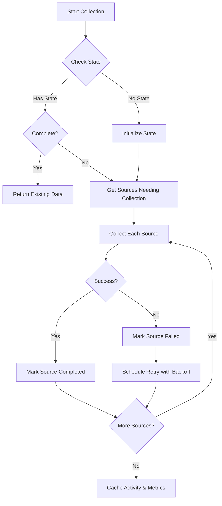

# RIS Resumable Data Collection System

## Overview

The RIS data collection system is now **fully resumable and fault-tolerant**. If data collection fails mid-process (API rate limits, network errors, etc.), the system:

1. ✅ Saves exactly which data sources succeeded/failed
2. ✅ Automatically schedules retry with exponential backoff
3. ✅ Resumes from where it left off (doesn't restart from scratch)
4. ✅ Calculates metrics even with partial data
5. ✅ Provides monitoring endpoints for admin visibility

---

## Architecture

### Data Sources (8 Independent Sources)

Each library's data comes from 8 independent sources:

| Source | What It Collects | Can Fail Independently |
|--------|------------------|----------------------|
| `github_basic` | Stars, forks, archived status, last commit | ✅ |
| `github_prs` | Pull requests (last 24 months) | ✅ |
| `github_issues` | Issues (last 24 months) | ✅ |
| `github_commits` | Commits (sampled, last 1000) | ✅ |
| `github_releases` | Releases (last 100) | ✅ |
| `npm_metrics` | Downloads, dependents count | ✅ |
| `cdn_metrics` | jsDelivr CDN hits | ✅ |
| `ossf_metrics` | OpenSSF security scorecard | ✅ |

**Key insight**: If NPM fails but GitHub succeeds, we still have most of the data for RIS scoring!

### Collection States

Each source can be in one of these states:

- **`pending`** - Not yet collected
- **`in_progress`** - Currently being collected
- **`completed`** - Successfully collected
- **`failed`** - Failed (will retry)

---

## How It Works

### 1. Library Approval Triggers Collection

```typescript
// When admin approves library:
POST /api/admin/libraries/approve
{
  "owner": "facebook",
  "repo": "react"
}

// Response (returns immediately):
{
  "success": true,
  "message": "Library approved. Data collection started in background."
}
```

**What happens behind the scenes:**
1. Library moved from `pending` to `approved` in Redis
2. Installation tracked (enables webhooks)
3. **Baseline collection starts asynchronously**
   - Admin UI responds immediately (doesn't wait)
   - Collection runs in background
   - Takes 30-90 seconds per library

### 2. Resumable Collection Process



### 3. Exponential Backoff Retry

If a source fails, it's automatically retried with increasing delays:

| Attempt | Wait Time |
|---------|-----------|
| 1st failure | 2 minutes |
| 2nd failure | 4 minutes |
| 3rd failure | 8 minutes |
| 4th failure | 16 minutes |
| 5th failure | 32 minutes |
| 6th+ failure | 60 minutes (max) |

**Example scenario:**
```
12:00 PM - Collection starts
12:01 PM - GitHub rate limit hit on PRs
12:01 PM - Other sources continue and complete
12:03 PM - Retry PRs (2min backoff)
12:03 PM - Success! Collection complete
```

### 4. Scheduled Retry Job

You should set up a cron job to process retries:

```bash
# Every 15 minutes
*/15 * * * * curl -X POST http://localhost:3000/api/admin/ris/retry
```

Or via code:
```typescript
import { processRetries } from '@/lib/ris/collection-scheduler';

// Process up to 10 retries
await processRetries(10);
```

---

## API Endpoints

### Check Collection Status

**GET** `/api/admin/ris/status`

Query parameters:
- `type=overview` - Overall stats (default)
- `type=failed` - List failed collections
- `type=library&owner=facebook&repo=react` - Specific library status

**Response (overview):**
```json
{
  "success": true,
  "stats": {
    "total_failed": 3,
    "pending_retries": 5,
    "approved_libraries": 54
  }
}
```

**Response (library):**
```json
{
  "success": true,
  "library": "facebook/react",
  "state": {
    "github_basic": { "status": "completed", "collected_at": "2025-10-26T12:00:00Z" },
    "github_prs": { "status": "completed", "items_collected": 247 },
    "github_issues": { "status": "completed", "items_collected": 156 },
    "github_commits": { "status": "completed", "items_collected": 1000 },
    "github_releases": { "status": "completed", "items_collected": 45 },
    "npm_metrics": { "status": "failed", "error": "Rate limit exceeded", "retry_count": 2 },
    "cdn_metrics": { "status": "pending" },
    "ossf_metrics": { "status": "completed" },
    "is_complete": false,
    "is_partial": true,
    "started_at": "2025-10-26T12:00:00Z",
    "last_attempt_at": "2025-10-26T12:05:00Z",
    "next_retry_at": "2025-10-26T12:09:00Z"
  }
}
```

### Manual Retry

**POST** `/api/admin/ris/retry`

**Retry specific library:**
```json
{
  "owner": "facebook",
  "repo": "react"
}
```

**Response:**
```json
{
  "success": true,
  "library": "facebook/react",
  "result": {
    "completed": false,
    "partial": true,
    "failed": false,
    "failedSources": ["npm_metrics"]
  }
}
```

**Retry all pending:**
```json
{
  "maxRetries": 10
}
```

**Response:**
```json
{
  "success": true,
  "stats": {
    "attempted": 5,
    "succeeded": 3,
    "partial": 1,
    "failed": 1
  }
}
```

---

## Monitoring & Debugging

### Check What's Failed

```bash
curl http://localhost:3000/api/admin/ris/status?type=failed
```

### Check Specific Library

```bash
curl "http://localhost:3000/api/admin/ris/status?type=library&owner=facebook&repo=react"
```

### Force Retry a Library

```bash
curl -X POST http://localhost:3000/api/admin/ris/retry \
  -H "Content-Type: application/json" \
  -d '{"owner": "facebook", "repo": "react"}'
```

### View Redis State

```bash
# List all failed collections
redis-cli ZREVRANGE ris:collection:failed 0 10 WITHSCORES

# Check specific library state
redis-cli GET "ris:collection:state:facebook/react"

# List pending retries
redis-cli ZRANGEBYSCORE ris:collection:retry 0 $(date +%s) LIMIT 0 10
```

---

## Code Usage

### Trigger Collection Manually

```typescript
import { collectBaselineForLibrary } from '@/lib/ris/baseline-collection';

// Collect with resume (recommended)
const result = await collectBaselineForLibrary(
  'facebook',
  'react',
  'react',
  { resume: true }
);

if (result.success && !result.isPartial) {
  console.log('✅ Collection complete');
} else if (result.isPartial) {
  console.log(`⚠️ Partial: ${result.failedSources?.join(', ')} failed`);
} else {
  console.log(`❌ Failed: ${result.error}`);
}
```

### Check Collection State

```typescript
import { getCollectionState } from '@/lib/ris/collection-state';

const state = await getCollectionState('facebook', 'react');

if (!state) {
  console.log('No collection started yet');
} else if (state.is_complete) {
  console.log('Collection complete!');
} else if (state.is_partial) {
  console.log('Partial data collected, retrying failed sources...');
} else {
  console.log('Collection in progress or all sources failed');
}
```

### Get Libraries Needing Retry

```typescript
import { getLibrariesNeedingRetry } from '@/lib/ris/collection-state';

const libraries = await getLibrariesNeedingRetry(50);
console.log(`${libraries.length} libraries need retry`);
```

### Process Retries

```typescript
import { processRetries } from '@/lib/ris/collection-scheduler';

const stats = await processRetries(10);
console.log(`Retried ${stats.attempted}, succeeded: ${stats.succeeded}`);
```

---

## Scheduled Jobs (Recommended Setup)

### Option 1: Node Cron

```typescript
import cron from 'node-cron';
import { processRetries } from '@/lib/ris/collection-scheduler';
import { refreshAllLibraries } from '@/lib/ris/collection-scheduler';

// Process retries every 15 minutes
cron.schedule('*/15 * * * *', async () => {
  console.log('🔄 Running scheduled retry job...');
  await processRetries(20);
});

// Full refresh every Sunday at 3am
cron.schedule('0 3 * * 0', async () => {
  console.log('🔄 Running weekly refresh...');
  await refreshAllLibraries();
});
```

### Option 2: Vercel Cron

```typescript
// app/api/cron/retry/route.ts
import { NextResponse } from 'next/server';
import { processRetries } from '@/lib/ris/collection-scheduler';

export async function GET(request: Request) {
  // Verify Vercel cron secret
  const authHeader = request.headers.get('authorization');
  if (authHeader !== `Bearer ${process.env.CRON_SECRET}`) {
    return NextResponse.json({ error: 'Unauthorized' }, { status: 401 });
  }

  const stats = await processRetries(20);
  return NextResponse.json(stats);
}

export const runtime = 'nodejs';
export const maxDuration = 300; // 5 minutes
```

```json
// vercel.json
{
  "crons": [
    {
      "path": "/api/cron/retry",
      "schedule": "*/15 * * * *"
    },
    {
      "path": "/api/cron/refresh",
      "schedule": "0 3 * * 0"
    }
  ]
}
```

### Option 3: GitHub Actions

```yaml
# .github/workflows/ris-retry.yml
name: RIS Collection Retry
on:
  schedule:
    - cron: '*/15 * * * *' # Every 15 minutes

jobs:
  retry:
    runs-on: ubuntu-latest
    steps:
      - name: Trigger retry
        run: |
          curl -X POST ${{ secrets.APP_URL }}/api/admin/ris/retry \
            -H "Authorization: Bearer ${{ secrets.ADMIN_API_TOKEN }}"
```

---

## Best Practices

### 1. Don't Block on Collection
```typescript
// ❌ BAD - Blocks admin UI
await collectBaselineForLibrary(owner, repo, libraryName);
return response;

// ✅ GOOD - Returns immediately
collectBaselineForLibrary(owner, repo, libraryName)
  .then(result => logger.info('Collection done', result))
  .catch(err => logger.error('Collection failed', err));
return response;
```

### 2. Always Use Resume
```typescript
// ✅ GOOD - Resumes from failures
await collectBaselineForLibrary(owner, repo, name, { resume: true });

// ❌ BAD - Restarts from scratch
await collectBaselineForLibrary(owner, repo, name, { resume: false });
```

### 3. Monitor Failed Collections
```typescript
// Check for stuck collections daily
const stats = await getCollectionStats();
if (stats.total_failed > 10) {
  alert('Many failed collections - check API keys!');
}
```

### 4. Handle Partial Success
```typescript
const result = await collectBaselineForLibrary(owner, repo, name);

if (result.isPartial) {
  // Still have SOME data - can calculate metrics
  // Failed sources will auto-retry
  logger.warn(`Partial data: ${result.failedSources?.join(', ')} failed`);

  // Metrics still calculated with available data
  // NPM data might be missing, but GitHub data is there
}
```

---

## Troubleshooting

### Collection Stuck in "in_progress"

```typescript
import { resetCollectionState } from '@/lib/ris/collection-state';

// Reset state to allow retry
await resetCollectionState('facebook', 'react');
```

### All Collections Failing

Check API tokens:
```bash
# GitHub token
curl -H "Authorization: Bearer $GITHUB_TOKEN" https://api.github.com/rate_limit

# Check remaining quota
redis-cli HGETALL "ris:collection:state:facebook/react"
```

### Retry Not Running

Check scheduled job:
```bash
# Test manually
curl -X POST http://localhost:3000/api/admin/ris/retry

# Check pending retries
redis-cli ZRANGEBYSCORE ris:collection:retry 0 $(date +%s)
```

---

## Performance

| Scenario | Time | Notes |
|----------|------|-------|
| Initial collection (success) | 30-90s | All sources succeed |
| Initial collection (partial) | 15-45s | Some sources fail fast |
| Retry failed source | 10-30s | Only retries what failed |
| Full ecosystem (54 libs) | 30-60min | Initial baseline |
| Weekly refresh | 10-20min | Incremental updates |

**Rate Limits:**
- GitHub PAT: 5,000 requests/hour
- Each library: ~15-30 requests
- Can collect ~200 libraries/hour with single PAT

---

## Summary

✅ **Fault-tolerant**: Survives API failures gracefully
✅ **Resumable**: Never starts from scratch after failure
✅ **Granular**: Each of 8 data sources tracked independently
✅ **Automatic**: Failed sources retry with exponential backoff
✅ **Observable**: Status endpoints show exactly what's failing
✅ **Non-blocking**: Admin actions complete immediately
✅ **Partial success**: Calculates metrics with available data

**Result**: Robust, production-ready data collection that handles real-world API failures!
